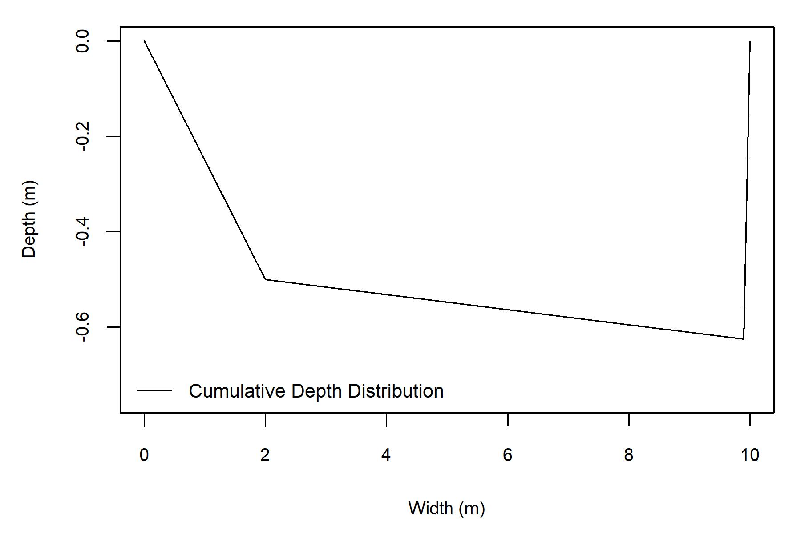
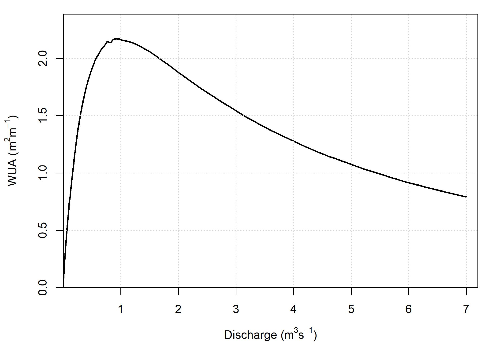

<br>
<br>

# Introduction

This page provides a guide for the use of the Geomorphic Approach for conducting instream flow assessments. Generally, the intent of instream flow assessments is to quantify available fish habitat at different flow levels using a metric called weighted usable area (*WUA*). The results of instream flow assessments are often used to support water allocation and management decisions.

There are two main components for determining the *WUA* of a stream: (1) hydraulic data to characterize the depth and velocity characteristics of the stream, and (2) a biological model that describe the relevant species’ preference for those hydraulic characteristics, known as habitat suitability curves (HSCs). Observations that characterize the substrate and cover characteristics and the associated fish preferences may also be used to calculate *WUA*.

Instream flow assessments using conventional methods are time consuming and expensive to implement and they only represent static channel conditions that represent a snapshot in time. The Geomorphic Approach has been designed to address these limitations by improving the hydraulic components of instream flow assessments. It can be implemented using minimal field data, and requires significantly less data processing and computing time compared to conventional methods.

The Geomorphic Approach has three distinct components: 

1. A reach-averaged hydraulic simulator, 
2. statistical distributions of depths and velocity that are used to calculate *WUA*, and 
3. a geomorphic regime model that can be used to predict how environmental change could affect channel conditions. 

This guidance is focused on the implementation of the hydraulic simulator and statistical distribution components of the Geomorphic Approach. Readers who are interested in the theoretical underpinnings of the this approach are referred to McParland et al. (2016) for information on the hydraulic simulator, Saraeva and Hardy (2009) and Schweizer et al. (2007) for information on the statistical distributions, and Eaton et al. (2004) for information on the geomorphic regime model. An evaluation of the Geomorphic Approach in eight streams located in western Canada is also in progress. Once the findings of this evaluation become available they will be shared on this webiste. Please check out the References tab for more links to these studies. 
 
<br>

## Model Overview

The hydraulic data necessary to execute the Geomorphic Approach can be collected during one field visit that does not have to coincide with specific flow conditions. To calculate *WUA*, users must define their own HSCs. The Geomorphic Approach produces distributions of channel hydraulics at the reach scale. Currently, the Geomorphic Approach is unable to model the habitat conditions of individual channel units, such as pools or riffles. 

The hydraulic simulator component of the Geomorphic Approach uses a reach-averaged channel cross section of bankfull geometry. Using the input data, an index of bankfull channel shape (*b*) is calculated that ranges from 0 (rectangular channel) to 1 (highly skewed channel). To simulate the hydraulics of flows below bankfull, the model iteratively drops the water level until the point of zero discharge. For each modelled water level, mean velocity and depth is calculated. 

Following the prediction of reach-averaged hydraulics, the next step is to apply statistical frequency distributions to represent reach-averaged variability. The resultant depth and velocity distributions can then be paired with user-specified habitat suitability curves to determine *WUA*. 

The third component of the Geomorphic Approach is the application of the UBC Regime Model (UBCRM). This model can be used to evaluate how environmental pertubations, such as climate and land-use change, are likely to affect bankfull parameters. The predicted channel geometry can then be used with the hydraulic simulator and the statistical frequency distributions to estimate the subsequent changes to fish habitat due to various environmental perturbations (i.e. ‘what-if’ scenarios). The UBCRM may also be used to estimate input parameters if field observations are limited. 

<br>

# Applying the Geomorphic Approach

<br>

### Field Considerations

There are many ways the Geomorphic Approach could be implemented. Field programs should be designed around project objectives. This section is intended to provide considerations for designing a field program, it is not a step-by-step guide for collecting field data.

When planning a field trip to collect data to run the Geomorphic Approach, it is necessary to identify the study reach. Then, channel geometry can be characterized by collecting depth data along a series of transects. The location and the appropriate number of transects are dependent on factors such as desired accuracy, access, and time. A robust approach is to identify cross sections randomly within the reach, but that is not always practical. Another option is to characterize the study reach by channel units (mesohabitats), and then identify transects within those classifications using a stratified random approach. When collecting cross sections, be sure to note the estimated bankfull elevations on either side of the channel. 

Another key data requirement to execute the Geomorphic Approach is a representative grain size distribution, which is used to evaluate channel roughness and estimate velocity. This can be conducted using a Wolman pebble count, analysis of photographs, or visual estimation. Because the field work does not need to coincide with any particular flow, these data are most easily collected during open-water, low flow conditions. Coordinating a field visit during low flows would also likely coincide with the safest conditions for wading.  

<br>

### Data Requirements

The input parameters for GIFT are as follows:

* **Channel gradient**, $S$ (m/m). This field is mandatory.
* **Bankfull width**, $W_b$ (m). This field is mandatory.
* **Mean bankfull depth**, $d_b$ (m). This field is mandatory.
* **Maximum bankfull depth,** $d_{max}$ (m). This field is optional.
* **84th percentile grain size**, $D_{84}$ (mm) (the grain size of which 84% of the bed is finer). 
* **Habitat Suitability Curves**. These are required to calculate *WUA*. Further information regarding the format that these curves should be in is included in the description of the Habitat function, below. 
* **Bankfull discharge**, $Q_{bf}$, is recommended, but is not required to run the hydraulic simulator. However, $Q_{bf}$ can be used to check that the bankfull dimensions generated by the model reflect empirical measurements. $Q_{bf}$ is necessary to run UBCRM.

The channel dimensions are used to generate an index of channel shape, *b*. If only db is provided, then *b* is calculated as follows: $$b = (W_b / d_b)$$ If $d_{max}$ is provided, then *b* is calculated as follows: $$b = 1 - (d_b/d_{max})$$ Alternatively, the R function allows the user to specify *b*, directly over-riding these functions. 

<br>

### Using the App
One option for evaluating the hydraulic simulator and statistical distribution components of the Geomorphic Approach is to use the interactive [App](https://sgronsdahl.github.io/GeomorphicApproach/app.html). Input data can be interactively entered and reach-averaged hydraulics and *WUA* outputs can be visualized and downloaded. 

<br>

### Using the R Package

For users familiar with R, the Geomorphic Approach is available as a package from GitHub. The below code snippet uses the 'devtools' package to install the package. Currently, there are two functions in the package, one to execute the hydraulic simulator and another to execute the statistical distributions and calculate *WUA*. The below code should be un-commented out where necessary to install the package for the first time. 

```{r, echo = T, message = F}

## install and load devtools
# install.packages(devtools)
# library(devtools)

## install and load package
# install_github("SGronsdahl/GeomorphicApproach")
library(GeomorphicApproach)

```

<br>

#### Executing the Hydraulic Simulator

The first function in the Geomorphic Approach package is the 'AvgHydraulics' function that executes the hydraulic simulator and produces a data frame of outputs. The below code snippet provides an example of how to run the model. The following code snippets showcase the execution of the AvgHydraulics function. In this scenario, $d_{max}$ is not specified, so the function assumes  $b = (W_b / d_b)$


```{r, echo = T, message = F}

hydraulics = AvgHydraulics(S = 0.01, wb = 10, db = 0.5, 
                           max_Q = 0.1, D84 = 100)
head(hydraulics)

```

<br>

The idealized reach-cross section generated by this analysis is as follows:
```{r, echo = F, message = T, out.width = '70%', fig.align='center'}
 
```

<br>

Here, the $d_{max}$ term is specificied within the AvgHydraulics function call, so the function assumes $b = 1 - (d_b/d_{max})$
```{r, echo = T}

hydraulics = AvgHydraulics(S = 0.01, wb = 10, db = 0.5, db_max = 1.25,
                           max_Q = 0.1, D84 = 100)
head(hydraulics)

```

<br>

The idealized reach-cross section generated by this analysis is as follows:
```{r, echo = F, message = T, out.width = '70%', fig.align='center'}
knitr::include_graphics('channel_xs_dmax.jpeg') 
```

<br>

Users may also specify a b-value, thereby over-riding either formula.

```{r, echo = T}

hydraulics = AvgHydraulics(S = 0.01, wb = 10, db = 0.5, db_max = 1.25,
                           max_Q = 0.1, D84 = 100, b_value = 0.2)
```

<br>

This function outputs a figure of the cross-section of the idealized reach and a .csv file of the simluated reach-averaged hydraulics. This feature may be turned off by specifying xs_ouput = FALSE, like so:

```{r, echo = T}

hydraulics = AvgHydraulics(S = 0.01, wb = 10, db = 0.5, db_max = 1.25,
                           max_Q = 1, D84 = 100, xs_output = FALSE)
```

<br>

#### Execute the Habitat Function

The Habitat function applies statistical frequency distribution to the mean depths and velocities that are output by the hydraulic simulator function. These disitributions are then paired with user-specified habitat suitability curves to generate reach-averaged depth and velocity suitabilities. To estimate the *WUA* of the stream reach, these suitabilities are multiplied with the modelled stream width to develop a *WUA* value in m^2^ / m. 

The input parameters for the Habitat function are as follows:

* **hydrualics**, a data frame of outputs generated by the AvgHydraulics function. This field is mandatory. 
* **d_curve**, depth suitability curve. This should be a dataframe with two columns: 'depth' (m) and 'suit' (dimensionless suitability from 0-1). This field is mandatory.
* **v_curve**, velocity suitability curve.  This should be a dataframe with two columns: 'velocity' (m/s) and 'suit' (dimensionless suitability from 0-1). This field is mandatory.
* **s_curve**, substrate suitability curve.  This is a dataframe of substrate suitabilities with three columns: 'lower' (mm) and 'upper' (mm) of grain size classes and 'suit' (dimensionless suitability from 0-1). This field is optional.
* **gsd**, vector of grain size distribution (mm). This field is optional.

Here are some example input data used for the subsequent examples. We will use rainbow trout parr suitability curves generated by Ron Ptolemy, Instream Flow Specialist, B.C. Ministry of Environment.

```{r, echo = T}

d_curve = read.csv("depth_suit_ptolemy.csv")%>% filter(species == "rainbow" & life_stage == "parr")
v_curve = read.csv("velocity_suit_ptolemy.csv")%>% filter(species == "rainbow" & life_stage == "parr")
s_curve = read.csv("substrate_suit_ptolemy.csv")%>% filter(species == "rainbow" & life_stage == "parr")
```

```{r, echo = F, fig.height = 4, fig.width = 15, warning=FALSE}

par(mfrow = c(1, 3), mar = c(4.75, 4.75, 0.5, 0.5),
    oma = c(0.3, 4.3, 0, 0))

plot(d_curve$depth, d_curve$suit, type = "l", 
     lwd = 2, col = "deepskyblue4", xlim = c(0, 1.25), 
     cex.axis = 2, cex.lab = 2, xlab = "Depth (m)",
     ylab = "Suitability")

plot(v_curve$velocity, v_curve$suit, type = "l", 
     lwd = 2, col = "deepskyblue4", xlim = c(0, 1.25),
     cex.axis = 2, cex.lab = 2, xlab =  "Velocity (m/s)", ylab = "")

plot(s_curve$lower, s_curve$suit, type = "l", 
     lwd = 2, col = "deepskyblue4", xlim = c(0.1, 400),
     xlab =  "Minimum Substrate (mm)", ylab = "",
     cex.axis = 2, cex.lab = 2)

```

<br>

The grain size distribution should be specified as a vector of numerical observations. For this example, a simulated disribution will be generated:

```{r, echo = T}
gsd = rnorm(100, mean = 75, sd = 25)
```

```{r, echo = F, fig.height = 4, fig.width = 5, fig.align='center'}
 hist(gsd, breaks = 20, 
         col = "cadetblue3",
         border = "deepskyblue4",
         xlab = "Grain Size (mm)",
         ylab = "Count", main = "")

```

<br>

And to refresh our memory, here is what the hydraulics data looks like that we generated earlier. 

```{r, echo = T}

head(hydraulics)
```

<br>

Here is an example of the execution of the Habitat function using just depth and velocity.

```{r, echo = T}

habitat = Habitat(hydraulics = hydraulics, d_curve = d_curve, v_curve = v_curve, max_Q = 0.1)
head(habitat)

```

<br>

It is also possible to define the grain size distribution and substrate suitability curves to include a reach-averaged substrate suitability. Both grain size distribution and substrate suitability curve must be specified to generate a substrate suitability value for the reach.

```{r, echo = T}

habitat = Habitat(hydraulics = hydraulics, d_curve = d_curve, 
                  v_curve = v_curve, s_curve = s_curve, gsd = gsd, max_Q = 1)
head(habitat)

```

<br>

The Habitat function outputs a streamflow - habitat curve to the working directory as well. This functionality can be overridden if 'wua_output = FALSE' is specified.

```{r, echo = F, message = T, out.width = '70%', fig.align='center'}
 
```

<br>


***
