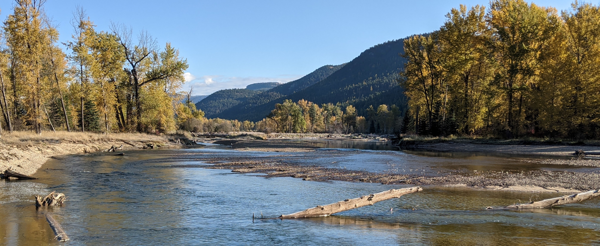

<center>
<br>
<br>

The Geomorphic Approach is a more efficient and proven approach for conducting instream flow assessments. The development of the Geomorphic Approach was funded by a grant from the [Habitat Conservation Trust Foundation](https://hctf.ca/).

<br>

```{r, echo = F, message = T, out.width = '30%', fig.align='center'}
 
```

<br>
<br>

All of the code presented on this page is free software: you can redistribute it and/or modify it under the terms of the GNU General Public License as published by the Free Software Foundation, either version 3 of the License, or (at your option) any later version. The code is distributed in the hope that it will be useful, but WITHOUT ANY WARRANTY; without even the implied warranty of  MERCHANTABILITY or FITNESS FOR A PARTICULAR PURPOSE.  See the GNU General Public License for more details.

<br>

For questions or enquiries regarding the Geomorphic Approach, contact Stefan Gronsdahl at: stefan.gronsdahl (at) pecg.ca

<br>

```{r, echo = F, message = T, out.width = '95%', fig.align='center'}
 
```

