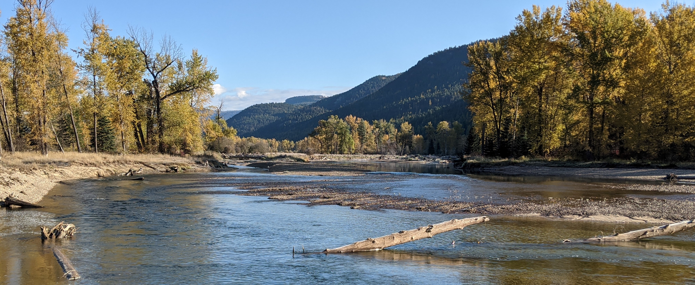

<br>
<br>
<br>
<br>


To access the source code for the Geomorphic Approach, users are directed to the following [GitHub repository](https://github.com/SGronsdahl/GeomorphicApproach). 

To access the source code for the UBC Regime Model component of the Geomorphic Approach, users are directed to Brett Eaton's [website](https://blogs.ubc.ca/beaton/working-code/)


<br>
<br>
<br>
<br>


```{r, echo = F, message = T, out.width = '95%', fig.align='center'}
 
```
